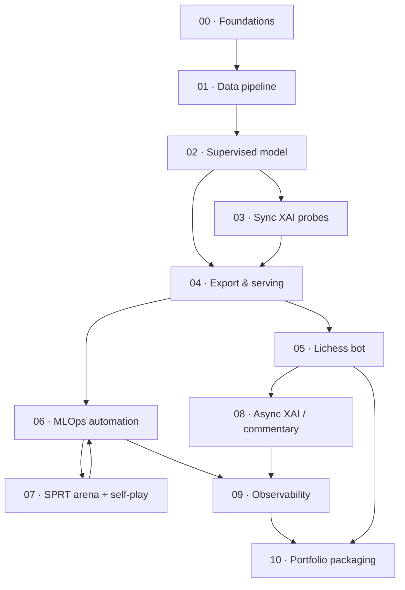

# Explainable Chess AI — Development Pipeline

Eleven phases, each ending in something demoable — a passing test suite, a served
endpoint, a bot playing a game, a dashboard with real data — rather than just "done."
The core deep-learning deliverable (supervised policy/value net + concept probing)
lands early; MLOps automation and the self-play loop wrap around it once there is
something real to automate.

Phases marked **(MVP path)** are the minimum route to a defensible portfolio piece
if time runs short — see the [Scope ladder](#scope-ladder).

---

## 00 · Foundations & scaffolding — *(MVP path)*

**Goal:** repo skeleton, tooling, and a sanity harness for chess rules before any ML
gets built on top.
**Estimate:** 3–5 days · **Tech:** python-chess, pre-commit, GitHub Actions

- Monorepo layout: `data/`, `training/`, `serving/`, `xai/`, `infra/`, `notebooks/`
- `uv`/Poetry + `pyproject.toml`; ruff, black, mypy via pre-commit
- python-chess sanity harness: legal move generation, FEN round-trip, PGN parsing
- ADR fixing the bitboard tensor spec (12 piece planes + side-to-move + castling ×4
  + en-passant + move-count) before any encoder code is written
- Dockerfile skeleton + devcontainer so the environment is reproducible from day one
- CI skeleton: lint + unit tests on every PR

**Exit criteria:** `pytest` green, including a test that encodes a FEN to tensor and
decodes it losslessly. CI runs green on push.

---

## 01 · Data ingestion & feature pipeline — *(MVP path)*

**Goal:** a reproducible, versioned dataset of (position, policy target, value
target) tensors built from real Lichess games.
**Estimate:** 1.5–2 weeks · **Tech:** DVC, Cloudflare R2, python-chess

- Stream-filter one month of the Lichess PGN dump by Elo — decompress and filter
  by header Elo without ever holding the full dump on disk. Raised to both
  players ≥2200 (from the original ≥2100 target) after real-data testing
  showed ≥2100's hit rate would take ~14 hours to reach a useful sample; ≥2200
  cut that to ~11 minutes
- Parse games, skip bullet-speed games (time control <180s); variants are
  excluded by construction, since the "standard" dump contains none
- Bitboard encoder per the Phase 0 ADR (ADR-0001); policy target as an
  AlphaZero-style 8×8×73 move-plane encoding (ADR-0003); value target = game
  result from the mover's perspective (ADR-0002 fix — the prior attempt's
  concrete bug)
- Split by *game*, not position, to avoid leakage — chronological split so later
  drift evaluation is realistic
- Encode positions on the fly at training time rather than persisting expanded
  tensors to disk — superseded the original "memory-mapped shards" plan once
  the math was run: expanded tensors would cost ~93x the filtered PGN's size
  (~53GB vs. 572MB for this dataset), blowing well past the R2 free tier for
  no benefit, since the CPU cost of encoding is trivial next to the GPU time
  training actually spends per batch (see ADR-0002)
- `dvc init`, R2 remote, `dvc.yaml`'s `ingest` stage (download → filter → write
  the filtered PGN). Encoding and the train/val split turned out to be runtime
  operations with no file output, given the on-the-fly design above — not
  separate pipeline stages, unlike the four originally scoped
- Generate a dataset card (size, Elo/date range, result distribution) alongside
  the filtered PGN — see
  [`docs/datasets/`](../docs/datasets/) for the one this phase produced

**Exit criteria:** `dvc repro` regenerates the byte-identical filtered PGN from
the raw monthly dump. A dataset card documents size, Elo distribution, date
range.

**Risk:** monthly dumps run 100GB+. Filter while streaming — never download
uncompressed in full. Also: a strict Elo filter can exhaust the games-per-cycle
cap within days rather than spanning the full month it's nominally drawn from —
worth checking the resulting dataset card's date range, not assuming it.

---

## 02 · Supervised base model — *(MVP path)*

**Goal:** the real deep-learning deliverable — a policy/value net trained on human
games. This alone is a complete, defensible project.
**Estimate:** 2–3 weeks · **Tech:** PyTorch, MLflow, Optuna

- ResNet trunk (6–10 residual blocks, 128–256 channels) + policy head
  (conv → 8×8×73 logits) + value head (conv → FC → tanh)
- Combined loss: cross-entropy (policy) + MSE (value) + L2 — as in the AlphaZero
  formulation
- Mixed precision, gradient clipping, cosine LR schedule with warmup, checkpointing
- MLflow tracking for every run: params, loss curves, artifacts; register the best
  checkpoint
- Baseline eval: top-1/top-3 move accuracy against held-out human games, value
  calibration via Brier score
- Small hyperparameter sweep (grid or Optuna) tracked as nested MLflow runs

**Exit criteria:** best checkpoint registered in MLflow with a documented
move-prediction accuracy benchmark against held-out GM games.

**Compute note:** this phase runs on one consumer GPU, or a rented A10/3090 spot
instance, in hours-to-a-day per run — this is where the project's real compute
budget lives, not self-play.

---

## 03 · Synchronous XAI layer

**Goal:** sub-100ms interpretability attached to the trained net — the project's
actual differentiator.
**Estimate:** 1.5–2 weeks · **Tech:** forward hooks, linear probes, integrated gradients

- Forward hooks on residual-block activations
- Build a labeled concept dataset (king exposure, center control, pawn integrity,
  material balance) via python-chess heuristics over the Phase 1 position set
- Fit linear/logistic probes on frozen activations per layer — literal linear
  concept probing, citable in the writeup
- Log probe accuracy/AUC per concept per layer to MLflow; this becomes the
  concept-drift signal monitored in Phase 9
- Feature attribution via integrated gradients or SARFA, rendered as a per-square
  saliency heatmap
- Package everything behind one `explain(board, model) -> ExplanationResult` call
  used by serving and notebooks alike

**Exit criteria:** a notebook demo producing concept scores + saliency heatmap for a
sample position in under 100ms on CPU.

---

## 04 · Model export & serving — *(MVP path)*

**Goal:** a containerized inference API a bot — or anything else — can actually call.
**Estimate:** 1–1.5 weeks · **Tech:** ONNX Runtime, FastAPI, Docker

- Export best checkpoint to ONNX; verify numeric parity against PyTorch on a
  validation batch
- FastAPI: `/move` (FEN in → move + eval + explanation out), `/health`, `/model-info`
- ONNX Runtime session, CPU baseline with optional CUDA provider
- Multi-stage Dockerfile, docker-compose for local dev (api + redis)
- Integration tests: boot the container, hit the endpoints, assert schema + latency
  budget in CI

**Exit criteria:** `docker run` serves a legal move for any legal FEN within the
latency budget, verified by a CI integration job.

---

## 05 · Lichess bot integration

**Goal:** the bot plays real games — the point where "chess engine" becomes "chess
player."
**Estimate:** 1–1.5 weeks · **Tech:** Lichess Bot API, NDJSON stream

- Register a bot account (BOT upgrade is one-way — do this on a throwaway account
  first)
- Handle the event stream: challenges, `gameStart`, `gameState` via
  long-polling/NDJSON
- Move selection calls the Phase 4 API; add clock-aware time management so it never
  overspends on one move
- Correctly handle threefold repetition, the 50-move rule, insufficient material,
  opponent aborts/disconnects; only accept standard variant challenges
- Post-game hook pushes PGN + result onto a Redis queue for Phase 8

**Exit criteria:** the bot completes a run of games end-to-end without crashing and
resolves every draw condition correctly.

---

## 06 · MLOps automation

**Goal:** the pipeline stops being something you run by hand.
**Estimate:** 1.5–2 weeks · **Tech:** Prefect, GitHub Actions, MLflow Registry

- Prefect flows wrapping Phase 1/2 as tasks: data-refresh flow, training flow,
  triggered by a new DVC dataset version or a schedule
- Make `dvc.yaml`'s `ingest` stage's `month` dynamic (computed at runtime, e.g.
  "last fully-completed month") instead of the hardcoded literal it is as of
  Phase 01 — a prerequisite for scheduling, not just an enhancement: as
  written, a scheduled `dvc repro` would keep re-fetching the same month
  forever and never pick up new data
- Scheduled `dvc repro && dvc push` (GitHub Actions cron or a Prefect
  deployment), committing the updated `dvc.lock` back to git so the new
  dataset version is actually discoverable, not just sitting in R2 unrecorded
- GitHub Actions: lint/test on PR, build + push the Docker image on merge, trigger
  the Prefect deployment
- Wire MLflow Registry stages (None → Staging → Production) to a promotion step —
  manual gate for now, automated once Phase 7 exists
- Secrets via GitHub Actions secrets in CI, `.env` locally (R2 keys, Lichess
  token) — never committed

**Exit criteria:** pushing a new DVC-tracked dataset version triggers a full
training run with no manual steps, visible in the Prefect UI and MLflow.

---

## 07 · SPRT arena & bounded self-play

**Goal:** a statistically rigorous promotion gate, and a deliberately scoped-down
continuous-learning loop.
**Estimate:** 2–3 weeks · **Tech:** SPRT, Stockfish, bounded MCTS

- Arena harness: candidate vs. current Production, and vs. fixed Stockfish skill
  levels, over a fixed opening suite to reduce variance
- Wald's SPRT (elo0/elo1 bounds e.g. 0/+20, α/β = 0.05), stopping early on a
  decisive result to conserve compute
- On a pass: promote in the MLflow Registry, re-export ONNX, rebuild the serving
  image
- Self-play generation capped per cycle (e.g. 500–2,000 games), light MCTS or
  temperature-sampled policy only
- Mix self-play data back into training at a controlled ratio (10–20%) alongside
  human games, to avoid distributional collapse

**Exit criteria:** one full cycle — self-play batch → retrain → SPRT arena →
promotion/rejection — runs automatically and logs an Elo-delta estimate with a
confidence interval.

**Risk — read this one twice:** this is the phase most likely to blow the compute
budget. Keep the self-play batch size and MCTS simulation count small and document
that as a deliberate scope decision, not a limitation discovered too late.

---

## 08 · Asynchronous XAI & commentary

**Goal:** every finished game turns into a grounded, checkable natural-language
recap.
**Estimate:** 1.5–2 weeks · **Tech:** Celery + Redis, Stockfish UCI, LLM

- Celery worker consuming the Phase 5 post-game queue
- Local Stockfish UCI, depth/time-limited, computing per-move centipawn loss → ACPL
  by side and game phase
- Run Phase 3 probes across the whole game to get a concept timeline (e.g. king
  safety over time)
- Few-shot-prompt a small LLM with the move list + ACPL flags + concept deltas so
  the recap is grounded in — and cites — the numeric signals, not free-form
- Persist recap + analysis artifacts, expose per-game via a simple endpoint or
  static page

**Exit criteria:** a recap is generated within a defined SLA (e.g. <2 min) after a
game ends, referencing the biggest blunder and at least one concept shift.

---

## 09 · Observability & monitoring

**Goal:** the system becomes operable, not just runnable.
**Estimate:** 1–1.5 weeks · **Tech:** Prometheus, Grafana, Evidently AI

- Prometheus client in FastAPI: latency histogram, error rate, request count, plus
  custom gauges for last SPRT Elo delta and concept-probe AUC per retrain
- Grafana dashboards: serving health, Lichess rating over time (pulled via the
  Lichess API), win/loss/draw by game phase, concept-calibration drift across
  retrains
- Evidently AI data-drift report each retrain cycle, comparing new training data to
  a reference distribution, logged as an MLflow artifact
- Basic alerting on latency SLA or SPRT regression breaches

**Exit criteria:** a dashboard showing at least one full retrain cycle of real
data — not synthetic — worth a screenshot in the portfolio.

---

## 10 · Portfolio packaging — *(MVP path)*

**Goal:** convert a working system into something legible in a CV and an interview.
**Estimate:** 3–5 days · **Tech:** writeup, demo

- Architecture diagram + README with a demo clip of a live game plus its generated
  recap
- A short technical writeup per subsystem — don't undersell the concept-probing
  work, it's the differentiator
- Public Lichess bot profile linked, with real game history
- Optional one-pager on the SPRT methodology with real numbers and real confidence
  intervals

**Exit criteria:** a two-minute demo you could run live in an interview, end to end.

---

## Scope ladder

What to cut first if the timeline compresses.

| Tier | Phases included | What it proves |
|---|---|---|
| **MVP** | 00, 01, 02, 04, 10 | A trained policy/value net, served over an API, with a real accuracy benchmark. A complete, defensible deep-learning project on its own. |
| **Interpretability-complete** | MVP + 03 | Adds the linear concept probes and saliency maps — the actual research differentiator for an AI Master's portfolio. |
| **Product-complete** | Interpretability-complete + 05, 06 | A bot that plays real Lichess games, automated end-to-end training on new data. |
| **Search-augmented** | Product-complete + PUCT/MCTS move selection (layered onto 04, 05) | Meaningfully stronger play via decision-time search instead of raw policy argmax, restricted to the top-k policy moves with a fixed simulation budget. Visit counts/PV become a natural input to Phase 08 commentary. Purely additive — no retraining or re-export of the model required — so it slots in whenever, independent of the rest of the ladder. |
| **Full vision** | All 11 phases | Adds the SPRT-gated self-play loop, async LLM commentary, and full observability — the complete MLOps + XAI system as originally scoped. |

## Risk register

| Risk | Phase | Severity | Mitigation |
|---|---|---|---|
| Self-play compute cost | 07 | High | Cap games/cycle and MCTS depth explicitly; treat as bounded fine-tuning, not AlphaZero-from-scratch. |
| Raw PGN dump size | 01 | Medium | Stream-filter by Elo while decompressing; never persist the full uncompressed dump. |
| Bot account is one-way (BOT upgrade) | 05 | Low | Test on a throwaway account before touching the account you want to keep. |
| LLM commentary hallucination | 08 | Medium | Ground the prompt in Stockfish ACPL and probe deltas; require the recap to cite specific numbers. |
| Draw-condition bugs (repetition, 50-move, insufficient material) | 05 | Medium | Cover explicitly in the Phase 0 python-chess harness before the bot goes live. |

---

## Cost analysis

What it costs to run this end-to-end, priced against the cheapest viable option
per component rather than the most convenient one. Figures are live market rates
as of August 2026 — verify before committing, especially the free-tier lines,
which providers do quietly shrink (see the Oracle row).

**Cheapest path, no local GPU: ~$0–3/month.** Free tier on every component except
LLM commentary calls, which run to a few cents per game. Occasional overflow spend
(~$5–15, one-off) only if a self-play cycle outruns Kaggle's free GPU quota.

**If you already own a GPU:** skip every compute row below. Local training is
electricity-cost only, with no weekly quota ceiling — strictly cheaper and less
fiddly than any cloud option here for Phases 02 and 07. Keep the cloud VM only for
Phases 04/05 (the bot needs to be up when your machine isn't).

| Component | Phase | Cheapest option | Cost | Notes |
|---|---|---|---|---|
| Dataset storage (DVC remote) | 01 | Cloudflare R2 free tier | Free | 10GB storage + 1M writes + 10M reads/mo, permanently, zero egress fees. Store compact PGN/move-lists rather than expanded float32 tensors and encode on-the-fly in the DataLoader — keeps the dataset under the cap indefinitely instead of growing into paid storage. |
| Supervised training compute | 02 | Kaggle Notebooks (T4/P100) | Free | ~30 GPU-hours/week, 12hr session cap, resets weekly. Comfortably covers the ResNet sizes in this plan. |
| Self-play + SPRT arena compute | 07 | Kaggle free quota; overflow to Vast.ai RTX 3090 spot | Free, ~$0.07–0.09/hr overflow | The 500–2,000-games/cycle cap in Phase 07 was sized to fit inside free GPU quotas — only pay when a cycle genuinely runs long. |
| Experiment tracking | 02 | Self-hosted MLflow (SQLite backend) | Free | No managed tracking server justified at this scale — run it locally, then on the same free VM as serving. |
| CI/CD | 06 | GitHub Actions, public repo | Free | Unlimited minutes on GitHub-hosted runners for public repositories — keep the repo public anyway, it's a portfolio piece. |
| Serving + bot uptime (needs ~24/7) | 04, 05 | Oracle Cloud Always Free ARM VM | Free | 2 OCPU / 12GB RAM (Oracle quietly halved this from 4/24 in June 2026 — still enough for CPU-only ONNX inference), 200GB disk, 10TB/mo egress. The bot only makes outbound calls to Lichess, so no inbound networking is required. |
| Async workers (Celery/Redis) | 08 | Same Oracle free VM, via docker-compose | Free | Inference load from a single bot account is small enough that API + bot + Redis + worker share one small VM comfortably. |
| Observability | 09 | Self-hosted Prometheus/Grafana, same VM | Free | Grafana Cloud's free tier is a fine alternative if you'd rather not self-host the dashboards. |
| LLM game commentary | 08 | Small hosted model, or local via Ollama | ~$0–2/mo | Recap volume is one call per finished game — negligible at portfolio game counts with a cheap hosted model. A local small model (CPU, same VM) gets this to exactly $0 at the cost of recap quality/latency. |

Sources: [Cloudflare R2 pricing](https://developers.cloudflare.com/r2/pricing) ·
[Oracle Always Free tier](https://cloudpricecheck.com/free-tier/oracle) ·
[Kaggle weekly GPU quota](https://www.kaggle.com/general/108481) ·
[Vast.ai RTX 3090 pricing](https://vast.ai/pricing/gpu/RTX-3090) ·
[GitHub Actions billing](https://docs.github.com/billing/managing-billing-for-github-actions/about-billing-for-github-actions).
Cloud free tiers get cut without notice (Oracle already has, once) — the
docker-compose setup in Phase 04/09 is portable to any ~$4–5/mo VPS (e.g. Hetzner
CX22) as a fallback, so nothing here is a hard dependency on one vendor staying
free forever.

---

*Living document — revise as phases complete. Rendered version:
[Development Pipeline artifact](https://claude.ai/code/artifact/478d880d-b981-44a6-bcd0-3a4922f46759).*
